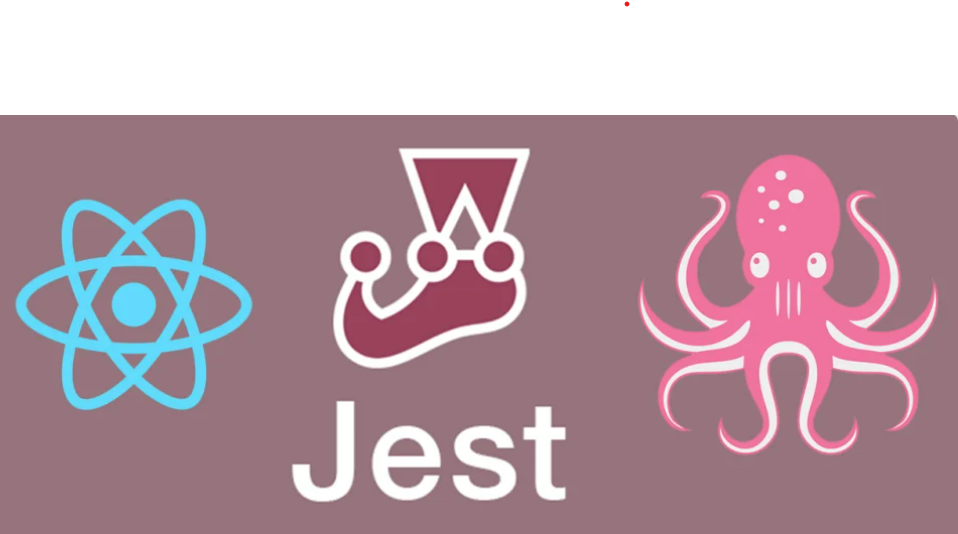

  # React Testing

  Testing is the process of evaluating a system or its component(s) with the intent to find whether it satisfies the specified requirements or not. In other words, testing is the process of verifying that a system behaves as expected. Testing can be done manually or automatically

  Manual testing is typically done by the developers as they write code and QA teams also perform manual testing. But it's writing automated tests is an efficient way to test our applications so that bugs/issues are found faster at every deployment or while creating adding components.

  There are two ways to write these automated tests:

  - Test after development (TAD): writing tests after the features are created.
  - Test driven development (TDD): writing tests before writing the features.

  ## Levels of Testing

  There are generally three levels of testing:

  **Unit testing** involves testing individual units or components of a system in isolation from the rest of the system. It is typically done by the developers as they write code, and it helps to ensure that the individual units of the system are working correctly.

  **Integration testing** involves testing the interactions between different units or components of a system. It helps to ensure that the units of the system are working together correctly and that there are no conflicts between them.

  **End To End testing** involves testing the entire system as a whole, including all of its components and their interactions. It is typically done after integration testing and helps to ensure that the system is working correctly in its entirety. (libraries to be used - Cypress, Playright or Puppeteer)

  > We are going to Cover Unit Testing and Integration testing here using JEST and React Teating Library.
  > 

  ## More about the tools to be used (React Testing Library and JEST)

  >- **JEST**
  >
  >Jest is a JavaScript test runner that lets you access the DOM via jsdom. While jsdom is only an approximation of how the browser works, it is often good enough for testing React components. Jest provides a great iteration speed combined with powerful features like mocking modules and timers so you can have more control over how the code executes.
  >
  >- **React Testing Library**
  >
  >React Testing Library is a set of helpers that let you test React components without relying on their implementation details. This approach makes refactoring a breeze and also nudges you towards best practices for accessibility. Although it doesn’t provide a way to “shallowly” render a component without its children, a test runner like Jest lets you do this by mocking.

  ## Setting Up Testing Environment on different BUILDS

  - **CRA**:
    CRA includes a set of scripts and configurations that make it easy to test your React components. You can just start writing tests.

  - **Vite**:
    Vite uses Vitest to test the applications by default, to reconfigure the build to test using jest you can follow steps given [here](https://codingwithmanny.medium.com/quick-jest-setup-with-vitejs-react-typescript-82f325e4323f).

  - **Custom Build**:
    To use the React Testing Library and Jest in a custom build setup for your React application, you will need to do install the RTL and Jest as dependencies and create configuration file for jest. Then we can start writing our test. To get help you can follow steps [here](https://dev.to/ivadyhabimana/setup-jest-and-react-testing-library-in-a-react-project-a-step-by-step-guide-1mf0). 

## Running Tests

> The CRA has scripts that run the tests in __test__ folder or with name Component.test.js
> To run the test you could run following command in terminal:
> 
    npm run test
